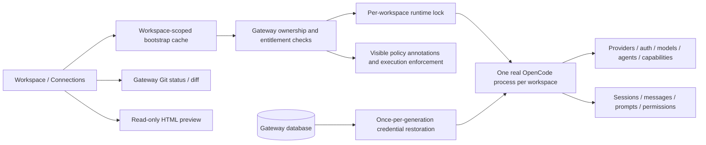

# OpenCode integration report — updates

Date: 2026-10-07. Implemented locally on `updates`, starting from `55d11739a3fa757b01a77d0a8450a38f1807a4b3`. No merge to master or push. The final response supplies the local commit SHA; `git rev-parse HEAD` identifies it after checkout. `.github/workflows/` and billing/payment code are unchanged.

## Outcome and acceptance limits

The selected workspace runtime now owns provider/agent/model discovery, auth, sessions, messages, prompt execution and runtime capability state. Gateway owns account authorization, entitlement enforcement, encrypted API-key storage, policy annotations/enforcement, workspace Git/files and UI presentation. It has no independent provider/agent/model catalog.

The installed real OpenCode **1.18.32** returned **223 providers**, ten provider-specific auth schema entries and seven agents. Real cold/warm process reuse, catalog discovery, session creation/listing/deletion, two-runtime session isolation and session policy updates were checked. Regression tests and labeled desktop/mobile UI verification pass.

**Real-provider acceptance is incomplete.** Gemini and DeepSeek keys are absent from the application/server environment, and the canonical DB has no authenticated customer/workspace available. No customers or payment records were created. An actual prompt through the runtime's default `opencode/big-pickle` model completed with an upstream `APIError`, HTTP **403**, and no text. Gateway rejected that result with 422; it is not successful model validation. Its temporary session was deleted. OAuth schema/UI was verified; an actual external OAuth login was not completed.

All model tests omit `agent` / `agent_id`. Big Pickle is the real OpenCode **model**, not an agent: `/provider.default.opencode` is `big-pickle`. `/config.default_agent` is absent. The UI displays **Default** and leaves the agent unspecified, allowing OpenCode to resolve it. Upstream 1.18.32 `packages/opencode/src/agent/agent.ts` resolves its unconfigured primary default internally; Gateway does not choose `build`.

## Cloud development configuration

The canonical development server was restarted with the current code. Local `app.env` now enables workspace runtimes and points to the installed native OpenCode 1.18.32 binary. A private persistent encryption key was created only because none existed; no provider key was generated or fabricated. The existing PostgreSQL data/configuration were preserved. Installation was rerun successfully with a writable npm cache, and Gateway health, frontend, database-backed countries/plans, unauthenticated profile protection and secret-file denial were checked. Alembic current/head is `0011_payer_identity`.

The cloud configuration draft was successfully saved with updated **install_script**, **start_skill**, a **GEMINI_API_KEY** requirement (name only), and these custom network destinations: `models.dev`, `opencode.ai`, `generativelanguage.googleapis.com`, `api.deepseek.com`. Existing package-manager presets remain. Saving is not runtime application or publication; the tool reports `requires_publish: true`. Review/save those settings and publish the environment through its UI when appropriate. Source code is only committed locally on updates, not pushed/merged/deployed; local-only commit restoration in a fresh task has not been verified.

The observed default-model 403 has not been proven to be a provider credential error versus an environment egress denial. The added draft destinations do not establish live access. Real-provider checks still require secure credentials, confirmed network access and an existing authenticated workspace.

## The 17 points

| # | Requirement | Implementation / evidence | Remaining acceptance |
|---|---|---|---|
| 1 | All real providers | `providers.catalog`, runtime bootstrap, composer and Connections retain all 223 live catalog entries. Disconnected/restricted entries remain visible. | Authenticated customer browser confirmation. |
| 2 | Real API/OAuth auth | Live `/provider/auth` methods, indices, text/select prompts and `when` conditions are preserved. API PUT and OAuth authorize/callback go to the same selected runtime. | Real API-key connection and OAuth login. |
| 3 | Real capabilities | Health/version/catalog/models/agents/default/sessions/permissions/tools/identity plus VCS, project, MCP, LSP, formatters, session status and questions. Settings has lazy expandable metadata. | Verify additional capabilities on a user's configured project. |
| 4 | One bootstrap | `GET /api/workspaces/{workspace_id}/runtime`, ownership/entitlement checked, one coherent serialized snapshot. Failed endpoints remain null with errors; auth discovery failure does not erase provider/agent data. | Full authenticated HTTP latency measurement. |
| 5 | Startup performance | Per-workspace RLock, one generation/start, Linux process ownership lock, pooled service, snapshot single-flight, warm reuse and once-per-generation restoration. | Saved-key cold/restart acceptance. |
| 6 | Runtime agents/default | All agent metadata surfaced; Default remains selectable regardless of connections. Primary selection obeys live mode/hidden properties. No automatic build override. | Successful default-agent Gemini/DeepSeek prompt. |
| 7 | Runtime models | Models are derived from each provider's runtime model map; live provider defaults select Big Pickle here. Restricted models remain labeled/disabled. | Connected paid-provider model comparison. |
| 8 | Selected-runtime Settings | Connections and workspace settings share the same bootstrap/cache. No workspace Settings request to reference port 4096. | Authenticated navigation check. |
| 9 | HTTP efficiency | One httpx client per runtime, concurrent discovery, total 30-second startup health deadline, reuse health interval, explicit 502/503/504 failures. | Production network/cold-cache measurements. |
| 10 | Credential lifecycle | Restoration moved to startup initialization; no credential loop on provider requests. Legacy bare keys and new metadata records supported. Delete must be acknowledged and disconnected before stored-row deletion. | Real saved-key restart and real disconnect. |
| 11 | Genuine key validation | Temporary tool-denied session sends an actual model request without an agent override. Requires completed, matching-provider/model, error-free text. Persist encrypted auth only afterward; remove/restore old state on failure. Unit regressions verify failure never persists. | Gemini/DeepSeek key unavailable; no successful live credential validation yet. |
| 12 | Frontend bootstrap | Workspace shell appears before discovery completes. Per-workspace cache with 10-second freshness and in-flight coalescing; invalidation on auth mutations. No full reload. | Real-user first-visible timings. |
| 13 | Visible policy | Providers/models have `allowed` annotations rather than removal. Send/auth enforce provider/model policy. Current session tool rules checked before prompts, confirmed and updated on policy changes; approval cannot permit restricted tools/external directories. | Real model/tool execution acceptance. |
| 14 | Real E2E | Real process/catalog/auth schema/session/default-model attempt/reuse/two-runtime isolation and session policy roundtrip tested. | **Partial:** successful prompt, external OAuth, saved-key Gateway restart, authenticated customer browser. |
| 15 | Measurements | Endpoint timings/counts, spawn/health/restore/bootstrap metrics and frontend performance marks added. Scoped baseline and current measurements below. | Full HTTP/serialization/network/browser timing; repeated samples and truly empty disk cache. |
| 16 | Scope restraint | Main client sidebar and unrelated pages preserved. Workspace follow-up uses compact Changes/Preview modes. No workflow, billing, payment or master changes. | Visual sign-off on an actual project. |
| 17 | Report | This report, TODO, evidence appendix, changed files, tests, screenshots and local commit SHA in final response. | Provider-dependent evidence will require an addendum. |

## Architecture

Each runtime receives an isolated HOME/XDG context and password-authenticated loopback server. Provider secret environment variables are not inherited into every workspace. Selected keys must be installed through that workspace's auth endpoint. OAuth is retained by OpenCode in its workspace-local auth storage; API keys additionally use Gateway encryption for restoration. Network proxy/trust environment variables remain available to the subprocess.

This is process/context separation, not an OS/container sandbox. Supported runtime versions are explicitly 1.18.31/1.18.32; live verification used 1.18.32. The supported Gateway deployment uses one worker. A Linux flock rejects another worker owning the same workspace instead of launching a duplicate. Windows lacks that interprocess lock; it still uses per-process thread locks.

## Exact baseline problems and corrections

These findings describe base `55d1173`; function names remain the best reference after edits.

| Severity | Exact file / function | Baseline behavior and effect | Correction |
|---|---|---|---|
| high | `backend/app/services/opencode.py` / `for_workspace` | One registry lock serialized startup work across workspaces. Repeated discovery used fresh HTTP requests. Health polling amplified cold waits. | Short registry lock, per-workspace startup lock, pooled client and one total health deadline. |
| high | `backend/app/routes/workspaces.py` / `_workspace_service`, `_install_stored_credentials` | Every provider route decrypted and PUT all saved workspace credentials again. Calls multiplied auth work. | Remove route restoration loop; initialize once per runtime generation for any first-start route. |
| high | `backend/app/services/providers.py` / `discover` | API-method-only transformation discarded OAuth-only providers/auth metadata and reduced the real catalog. | Preserve every runtime provider and full method schemas. |
| high | `backend/app/routes/workspaces.py` / `available_providers`; `backend/app/services/policy.py` / `filter_providers` | Policy removed providers/models from catalog, making OpenCode capabilities appear missing. | Annotate availability; enforce auth/send restrictions separately. Legacy `filter_providers` remains defined but is unused by the workspace catalog path. |
| high | `dashboards.js` / `refreshChoices`, `models`; `app.js` / `selectSession` | Connected-only filtering hid unconnected providers. Agents depended on provider connections and selected build/fallback locally. Session selection rediscovered providers. | All providers, independent agents, empty Default choice, live default model, no session-selection discovery. |
| high | `dashboards.js` / `openWorkspace`, page wrapper, choices observer, visibility handler | Multiple discovery triggers during one opening and navigation delayed ready state. Original opening awaited auxiliary work before choices. | Immediate shell, one shared async bootstrap, auxiliary Git/GitHub requests run separately; remove duplicate discovery observers/visibility trigger. |
| high | `dashboards.js` / `openConnections`; `management.js` / `providers` | Workspace Settings queried `/api/opencode/status`, whose service targets reference `OPENCODE_URL` (4096). Auth UI exposed only API keys. | Selected workspace bootstrap and real method rendering/forwarding. |
| high | `backend/app/routes/workspaces.py` / `set_provider_credential` | Connected/catalog checks were treated as sufficient key validation. | Real completed text response required before encryption/persistence, with rollback and temporary-session cleanup. |
| high | `backend/app/services/opencode.py` / `create_session`; `backend/app/services/policy.py` / `permission_config`; `backend/app/routes/agent.py` / `send`, `approve` | Session wildcard ask could override global restricted-tool deny; older sessions and later policy changes could retain broad rules. | Do not create a wildcard ask override; check current policy before each prompt and confirm any real session policy update; prevent restricted approvals; external-directory deny ordered last. |
| medium | `backend/app/routes/workspaces.py` / `sessions`, `session` | Gateway session rows drove UI existence/title instead of runtime discovery. | Synchronize owned UUID/runtime-ID mappings from live OpenCode, retain live metadata/title, omit child/archived sessions in main conversation history. |
| medium | `dashboards.js` / workspace panel construction; `index.html` / workspace styles | Multiple large internal navigation controls consumed space and duplicated features. | Two compact side-panel modes, conversation always centered, collapsible panel and compact session picker. |

### Filtering, transformation, cache and static definitions inventory

- `providers.catalog`: provider map → useful model array; preserves catalog membership, assigns live `connected`, `default_model`, `auth_methods` and policy `allowed`. Secret fields/host-path fields are excluded recursively; absolute permission-pattern paths are redacted.
- `policy.provider_allowed` / `model_allowed`: true policy gates for auth/send/validation. `filter_providers` is legacy, unused by runtime discovery. `permission_config`/`session_permissions` enforce tool rules.
- `runtime_snapshot.public_snapshot`: safe views of live capabilities; top-level model index contains IDs while complete model metadata remains in each provider, avoiding a duplicate full catalog. Session mapping is ownership/execution bookkeeping, not a fake OpenCode session.
- `OpenCodeService.snapshot`: per-generation one-second cache under the state lock; credential/OAuth/session mutations invalidate it. `for_workspace` reuses the living runtime and checks health at five-second intervals. No credentials are cached in browser snapshots.
- `runtime-client.js`: per-workspace ten-second cache and single-flight request; auth invalidation waits for stale in-flight work then refetches. Auth loss/logout clears browser cache.
- `dashboards.js.refreshChoices` / `models`: restricted providers/models remain visible but disabled; model selection requires a connection for sending. Agent selector stays visible; hidden/subagent entries are disabled for primary conversation selection, Default enabled. Runtime discovery failure disables the selector with a visible error; entitlement failure disables interaction. No provider connection is required to show agents.
- `management.js.providers`: no API-only/connected-only catalog filter. All live auth methods displayed; conditional prompts are rendered. Unsupported auth prompt/types are described explicitly. The API validation model dropdown selects allowed text models only, because this is validation, not catalog hiding. Full capability JSON is generated only when expanded.
- Providers without plugin-specific methods use OpenCode's supported native PUT `/auth/{providerID}` contract, explicitly labeled as the API endpoint; raw `/provider/auth` is unchanged. Discovery failure does not fabricate this fallback.
- No frontend provider names/agent defaults/model catalogs are hardcoded in the integration. `SUPPORTED_RUNTIME_VERSIONS`, secure validation instructions, primary/subagent mode rules and preview limitations are Gateway compatibility/UI logic. Repository project starter templates are unrelated to provider catalogs.
- Shared `/api/opencode/health` and `/api/opencode/status` remain compatibility/reference endpoints; the workspace/Connections path no longer calls them. Existing admin/dashboard reference health information is not selected-workspace health.

## Request flow and duplication

For an ordinary workspace opening, browser verification recorded exactly:

1. `GET /api/billing/subscription` — existing entitlement check, billing implementation unchanged.
2. `GET /api/workspaces/{id}/runtime` — selected workspace bootstrap.
3. `GET /api/workspaces/{id}/git/status` — Changes panel.
4. `GET /api/github/status` — existing repository connection display.

The bootstrap performs `/global/health` plus these **15** real runtime calls once per discovery pass, in parallel with up to eight workers:

`/provider`, `/provider/auth`, `/agent`, `/config`, `/permission`, `/experimental/tool/ids`, `/session`, `/path`, `/vcs`, `/mcp`, `/lsp`, `/formatter`, `/project/current`, `/session/status`, `/question`.

Cold startup additionally polls health, restores each saved key once with PUT `/auth/{providerID}`, and loads current tool policy. A warm bootstrap inside the server TTL reuses discovery; after TTL it refreshes capabilities on the same process. Warm browser navigation inside ten seconds needs no additional runtime HTTP request. It may still fetch entitlement, project/workspace picker and GitHub data as appropriate.

Selecting a conversation fetches Gateway `/sessions/{id}/messages`, starts `/events` SSE and polls `/permissions` every three seconds; OpenCode receives session messages and permissions calls on the same runtime. An open Changes panel also fetches Git status and `/sessions/{id}/diff`. No provider/agent discovery is triggered by session selection.

Creating a conversation calls POST `/workspaces/{id}/sessions`, one invalidated bootstrap, then conversation selection. Selecting a changed file requests `/workspaces/{id}/diff?path=...` unless OpenCode's session diff already provides its patch. Preview start/refresh requests `/workspaces/{id}/preview?path=...`.

API connect calls `/provider/auth` → PUT `/auth/{providerID}` → `/provider` → POST `/session` → POST `/session/{id}/message` → abort/delete temporary session. Only a successful real response permits persistence. Failure removes the candidate auth and restores previous saved auth if any. OAuth authorize/callback forwards the runtime's method index and inputs; callback verifies runtime connection. Disconnect requires DELETE acknowledgment and refreshed `/provider` disconnected state. Auth changes trigger one refreshed bootstrap; refreshing composer from Settings consumes that same cached result.

## Timing and request evidence

These are **single-sample local adapter timings**, not production/browser-load benchmarks. Old/new processes used the existing canonical checkout and already available on-disk runtime/cache state. The old measurement reproduced three discovery batches from the old opening flow; the new snapshot includes additional capabilities. No separate project checkout, database or test server was created.

| Measurement | Baseline | Current |
|---|---:|---:|
| Cold discovery/start sample | 26,899.51 ms | 4,536.29 ms |
| Warm discovery / in-process snapshot sample | 3,867.66 ms | 0.05 ms |
| Core provider/auth/agent requests per reproduced opening | 9 | 3 |
| Expanded non-health bootstrap API calls | unavailable as one endpoint | 15, each once |
| Browser requests on ordinary opening | 11 from code trace; observer/visibility could add more | 4 observed in labeled UI fixture |

The **0.05 ms** warm value is a same-process cache lookup and excludes Gateway policy/session serialization, HTTP transfer and DOM work. The full recorded public catalog is approximately **6.56 MB** before network compression; complete metadata has a real transfer/serialization cost. No claim is made that total runtime API calls fell to three: the new API also exposes twelve additional capabilities. Baseline browser count is a source trace, not an old-build browser measurement.

| Current runtime component | Observed time |
|---|---:|
| Process spawn | 0.36 ms |
| Spawn → health-ready | 2,538.75 ms |
| Credential restoration pass (zero saved keys) | 7.86 ms |
| `/provider` | 1,932.83 ms |
| `/provider/auth` | 162.77 ms |
| `/agent` | 876.38 ms |
| Parallel capability discovery | 1,936.58 ms |

This cold sample recorded 17 health GETs including bootstrap health and one call to each non-health endpoint. Restoration pass count remained **1** on reuse; actual saved-key PUT count was **0**, so this does not prove live restoration with credentials. Unit fixtures separately check encrypted metadata restoration and concurrent start/restart generation behavior.

Browser Performance entries: `OpenCode bootstrap {id}`, `OpenCode first visible providers {id}`, `OpenCode first visible agents {id}`. Backend diagnostics include endpoint timing/counts, generation and restoration status; the Gateway endpoint adds total bootstrap time. Real first-visible latency still requires the pending authenticated account/provider run.

## UI cleanup and screenshots

The large duplicated Sessions/Review/Conversation/Files/Diff/Activity toolbar is removed. Session history uses a small composer-context picker. The side panel has **Changes | Preview**, can collapse, and does not replace the center conversation. Main client sidebar and unrelated pages are unchanged.

Changes combines current runtime session diff metadata with real Gateway Git status, selectable changed files and selected-file diffs. Preview serves owned HTML and embeds allowed local assets inside an opaque-origin sandboxed iframe. CSP blocks network requests, forms and base URL changes; unsafe paths/symlinks are rejected. It is a static HTML preview. Backend dev servers, ES-module loading and Playwright/browser automation are not provided by this runtime integration and are shown as unavailable.

Screenshots below are **UI fixtures**, using the catalog recorded from real OpenCode plus fixture browser identity, entitlement, Git diff and preview content. They do not prove real account authentication, provider connection or project execution:

- `/workspace/gateway-local/screenshots/workspace-changes.png`
- `/workspace/gateway-local/screenshots/workspace-preview.png`
- `/workspace/gateway-local/screenshots/connections-oauth.png`
- `/workspace/gateway-local/screenshots/workspace-mobile.png`

Desktop viewport: 1440×1000. Mobile: 390×844. Browser assertions checked no duplicated toolbar, all 223 providers, empty Default agent override, Big Pickle selected from live metadata, OAuth-only GitHub Copilot method/conditional prompt, one bootstrap across warm navigation, no reference-health request and no page errors.

## Changed files and verification

| Files | Purpose |
|---|---|
| `backend/app/services/opencode.py` | Process lifecycle, locks, pooled HTTP, startup health, once restoration, diagnostics and snapshot. |
| `backend/app/services/providers.py` | Complete safe catalog/auth, API installation/restoration/removal, real validation and OAuth. |
| `backend/app/services/runtime_snapshot.py` (new) | Policy-annotated public capabilities and live-session mappings. |
| `backend/app/services/policy.py` | Current session tool rules; external-directory denial and deterministic ordering. |
| `backend/app/routes/workspaces.py` | Bootstrap, selected-runtime discovery/auth/live sessions, preview and per-file diff endpoint. |
| `backend/app/routes/agent.py` | Startup initialization reuse, current tool-policy enforcement and completed-response checks. |
| `backend/app/services/workspaces.py` | Safe selected-file Git diff. |
| `backend/app/services/preview.py` (new) | Read-only HTML preview rendering and asset boundaries. |
| `backend/app/routes/dependencies.py` | Preview included in existing read-only workspace allowance. |
| `backend/app/main.py` | Explicit public runtime-client asset and no-store handling. |
| `runtime-client.js` (new), `app.js` | Shared bootstrap cache and removal of session discovery; clear on auth loss. |
| `dashboards.js` | Runtime choices/defaults/settings, immediate shell, deduplication, Changes/Preview UI. |
| `management.js` | Full runtime catalog/auth UI, selected runtime metadata and coalesced auth refresh. |
| `index.html` | Runtime client loading/cache versions and scoped workspace styles. |
| `backend/verification/test_runtime.py`, `test_preview.py`, `runtime-client.test.cjs` (new) | Lifecycle/auth/catalog/policy/cache/preview regressions; fixtures explicitly labeled. |
| This report, TODO, evidence JSON, verification README | Reviewable status, evidence and reproducible independent checks. |

Checks: 21 Python regression cases, two Node bootstrap tests, all modified JavaScript syntax checks, Python compilation, `git diff --check`, actual OpenCode process/session/capability checks, real session policy PATCH/GET roundtrip, desktop/mobile Playwright verification. The browser test reads real app assets from the canonical development Gateway server and intercepts authenticated API data as clearly labeled fixtures; it is not the blocked end-to-end provider test.

## Remaining work in priority order

1. Complete points 11/14 using securely configured Gemini (`google`) or DeepSeek credentials and an existing real customer workspace; leave agent unspecified throughout.
2. Verify real OAuth-only login, credential disconnect/reconnect, one-pass saved-key restoration after Gateway restart, real browser navigation and provider-state isolation across two workspaces.
3. Collect repeated full HTTP/first-visible measurements, including JSON serialization and the complete catalog transfer; evaluate lazy metadata delivery/compression if transfer dominates. Do not remove provider capabilities to hide this cost.
4. Verify static preview on the actual customer project. Implement an isolated project dev-server/browser runner as a separate feature only if required; none is claimed here.
5. Keep deployment separate from this local implementation. Do not merge to master.

The full observed provider-ID list, actual auth schemas (including prompt conditions), agents and scoped metrics are in [OPENCODE_RUNTIME_EVIDENCE.json](OPENCODE_RUNTIME_EVIDENCE.json). No credential values are included.
